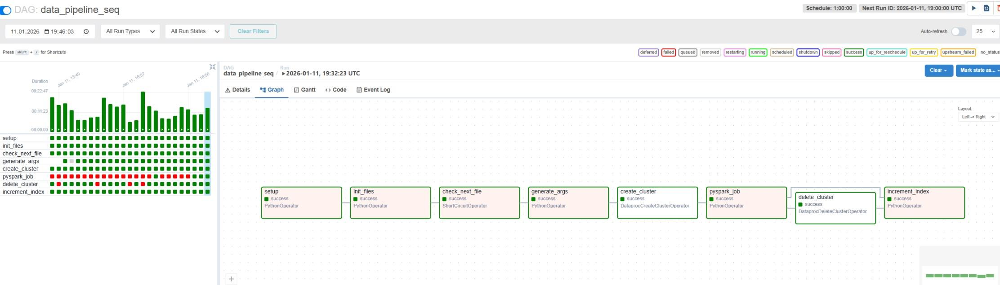
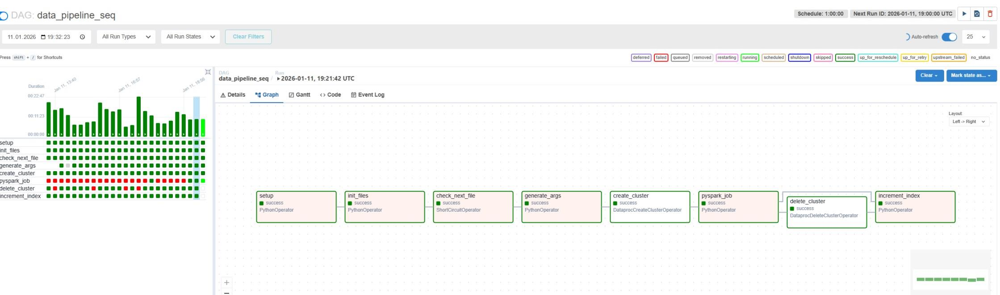
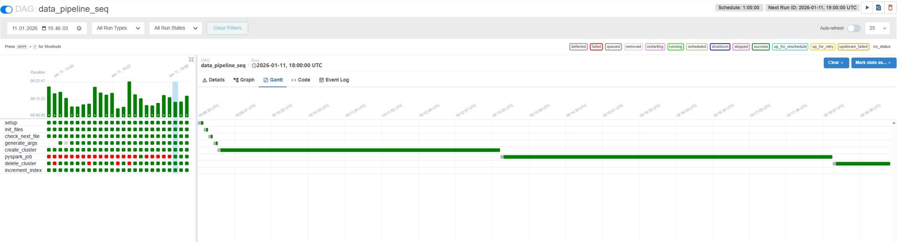
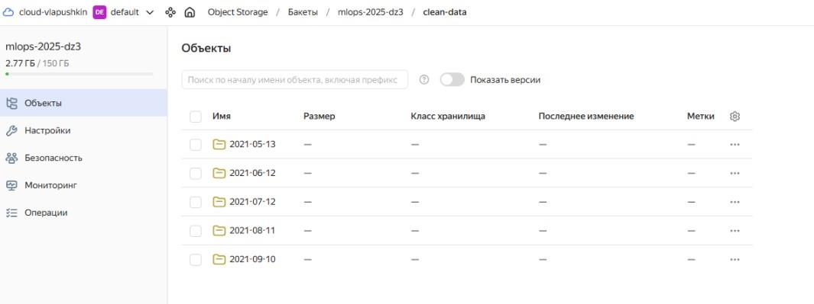
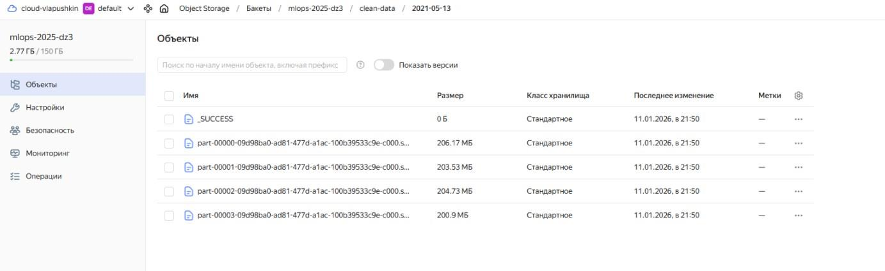
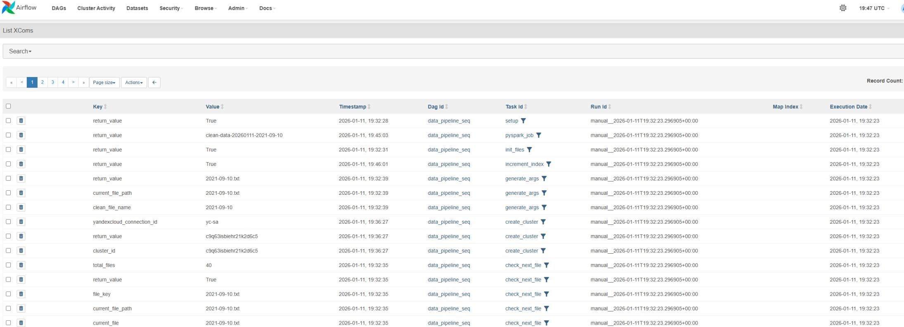
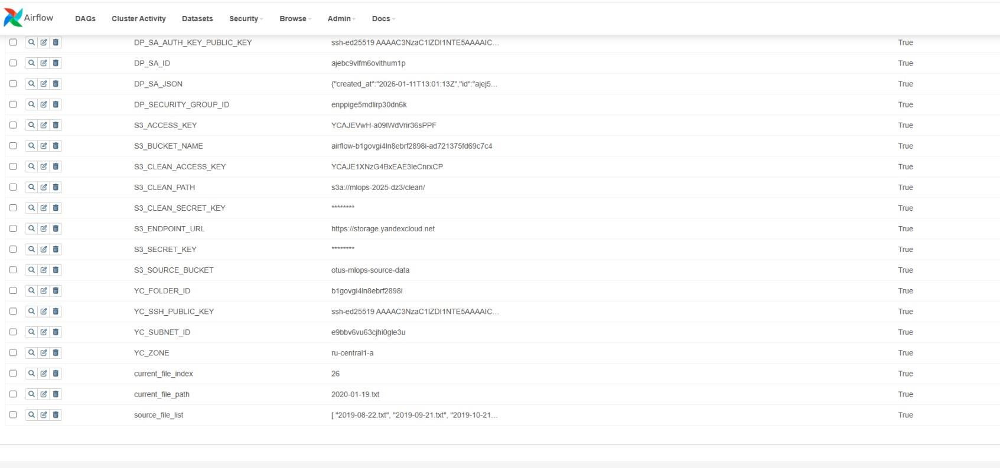

# OTUS. Практика. Конвейер подготовки данных
в задачах много выполненнных с ошибкой задач - это отладка
## скрин задач- граф

## скрин задач- граф 2

## скрин - гант

## скрин - бакет с очищенными данными

## скрин - бакет с очищенными данными в формате parquet

## скрин - xcom

## скрин - variables - видно выбор файлов с индексом из списка

## файлы из бакета источника по одному за проход (выполнение dag) очищаются и размещаются в целевом баете, там же размещаются логи.
## добавлен файл make_s3cmd.ini.cmd - генерация файла s3cmd.ini и размещение в директории (для windows)
после выполнения terraform apply следует запустить make_s3cmd.ini.cmd для возможности затем выполенния make (загрузка src и dag)
## код terraform адаптирован для windows (powershell)
