# OTUS. Регулярное переобчуние
За каждый проход DagRun производится очистка по одному файлу из общего хранилища.

Очищенные данные складываются в бакет в формате parquet.

Имя последнего очищенного файла сохраняется в бакете /clean/history/_watermark

В следующий прогон берётся следующий файл

Запускается задача по обучению, берутся N=5 (Задаётся в Dag) последних очищенных данных, на них проходит обучение, результаты складываются в mlflow, производится автоматическая регистрация модели с сохранением метрик и выбором champion в MLFlow

Видно, что вначале идёт обучение на 1 файле, затем на 2,3 и т.д видно увеличение времени как очистки, так и обучения

После выполенния terraform apply запустить create_s3cmd.sh для создания .s3cfg, копируется в домашнюю директорию

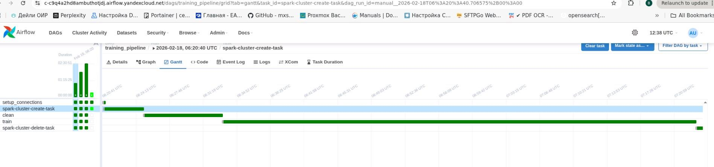

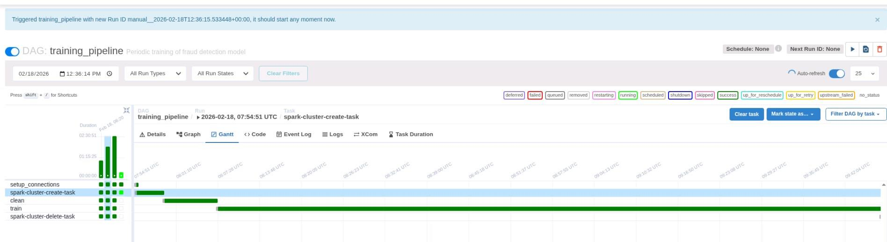

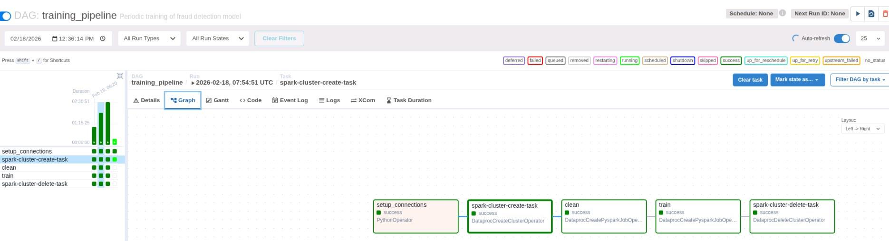

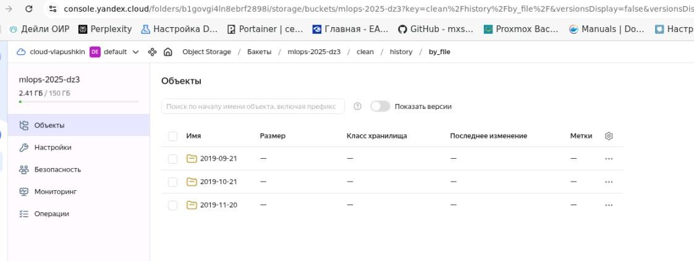

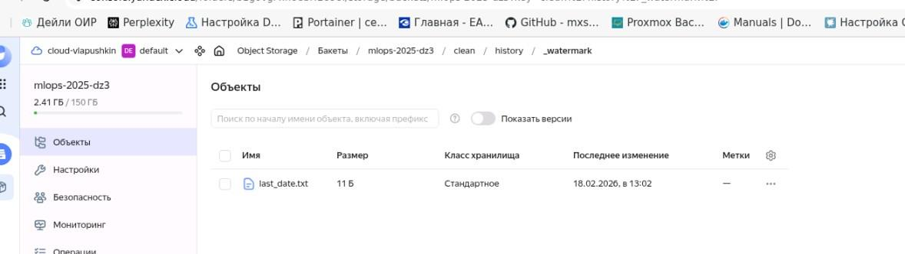

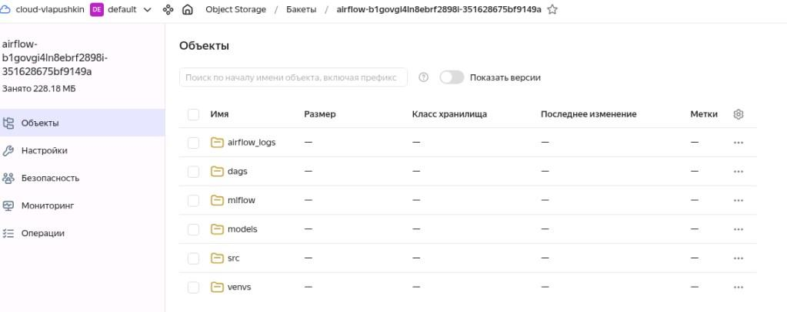

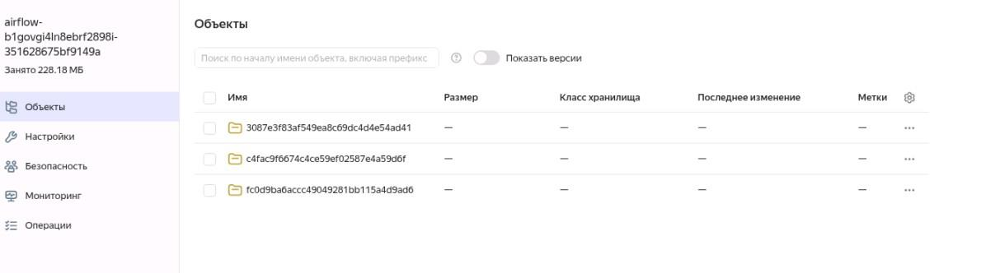

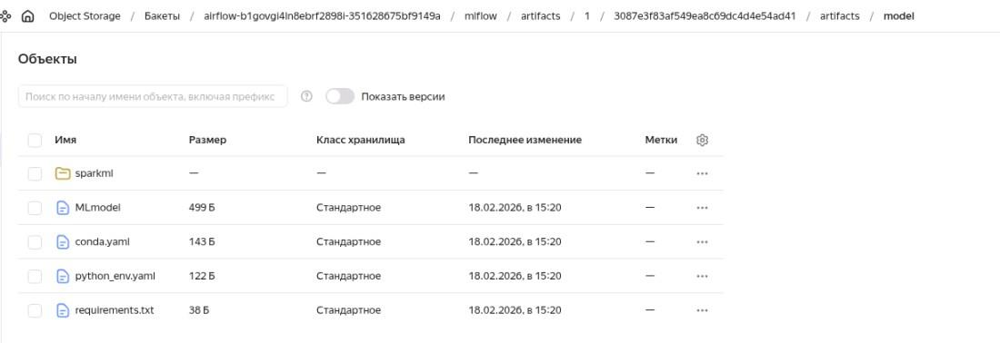

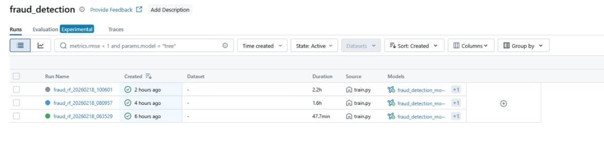

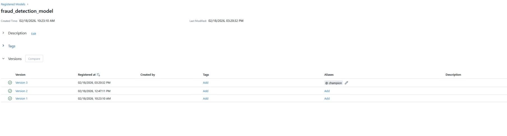

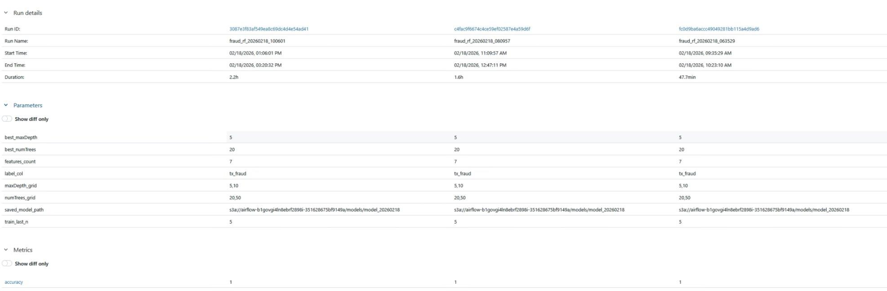
