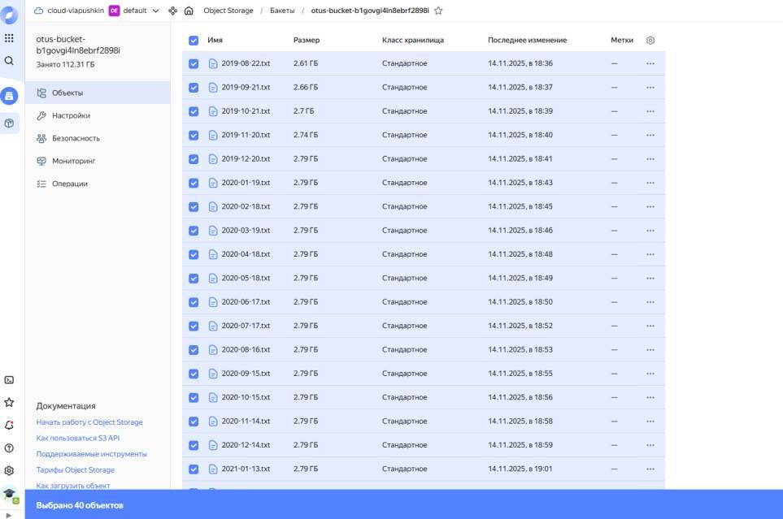
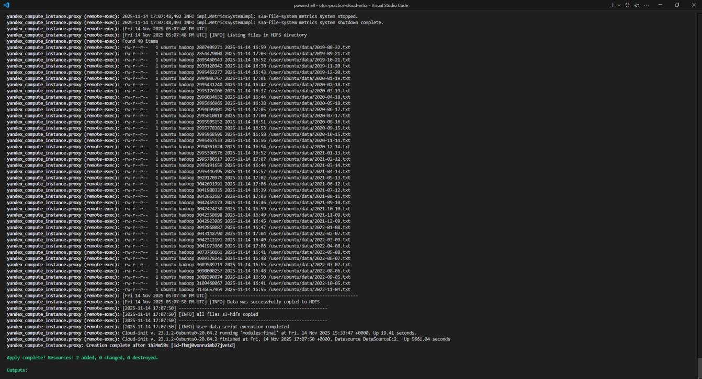

## скрин бакета

## скрин hdfs

нашёл способ обойтись без yc на прокси, положил пример в /infra/scripts/user_data_get_fqdn.sh - использую nmap сканер сети. проверено. работает (в этом примере убрал всю работу с бакетом и hdfs для сокращения времени отладки)

также можно получить IP masternode внутренней сети- вообще, не ясно, для чего fqdn нужен, по IP также подключиться по ssh спокойно можно.

также приложены файлы backet.txt и hdfs.txt c листингами
